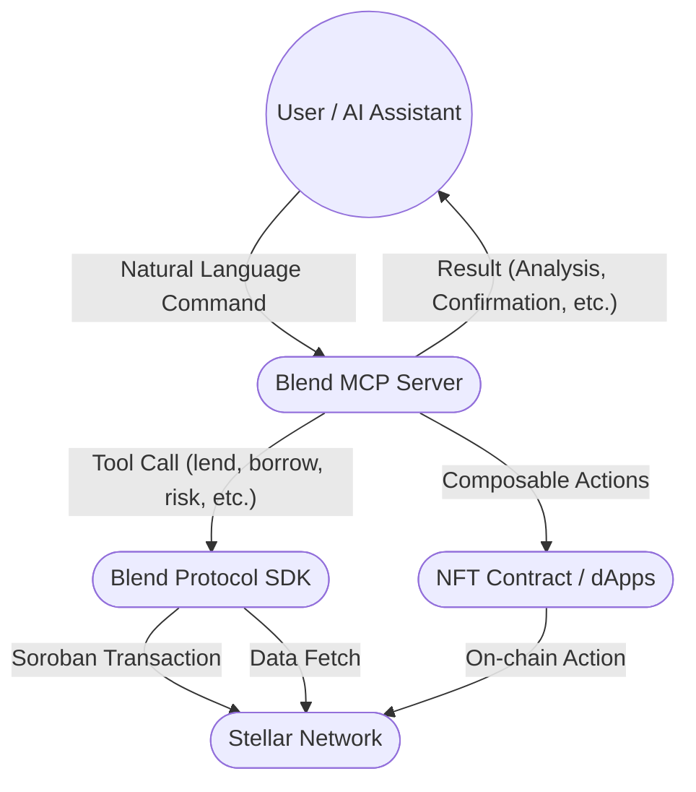

# Blend MCP

<p align="center">
  
</p>

## blend at your fingertips, just command

**Blend MCP** is the universal AI gateway for the Blend Protocol on Stellar. It exposes all Blend DeFi actions—lending, borrowing, pool creation, risk analysis, and more—as simple, composable tools accessible by any AI assistant, bot, or app.

---

## 🚀 Features

- **Natural Language DeFi:** Lend, borrow, repay, withdraw, and more—by command.
- **Pool Management:** Create new pools, add reserves, and manage Blend pools programmatically.
- **Risk Analysis:** Fetch and analyze pool/user data for safety and investment decisions.
- **Composable Workflows:** Chain actions together (e.g., "analyze pool, then lend if safe").
- **AI Assistant Integration:** Works with ChatGPT, Claude, or your own custom AI/bot.
- **Extensible:** Add new tools for NFTs, bridges, or any Soroban contract.
- **More features coming soon!**

---

## 🛠️ MCP Functions & Tools

Blend MCP exposes the following tools (functions) to any AI assistant or app:

| Tool Name           | Description |
|---------------------|-------------|
| `loadPoolData`      | Loads comprehensive data for a given Blend pool (optionally includes user position). |
| `getTokenBalance`   | Gets the balance of a specific token for a user address. |
| `getFeeStats`       | Gets current Soroban network fee statistics. |
| `getPoolEvents`     | Gets historical events for a specific pool. |
| `loadBackstopData`  | Loads data for the main Blend backstop contract. |
| `loadTokenMetadata` | Loads metadata for a given token/asset. |
| `simulateOperation` | Simulates a transaction operation without submitting it. |
| `lend`              | Lend (supply collateral) to a pool. |
| `withdraw`          | Withdraw assets from a pool. |
| `borrow`            | Borrow assets from a pool. |
| `repay`             | Repay borrowed assets to a pool. |
| `claimRewards`      | Claim available rewards from a pool. |
| `createPool`        | Deploy a new, permissionless lending pool. |
| `addReserve`        | Add a new asset reserve to a pool. |
| `buyNft`            | Buy an NFT from a Soroban NFT contract using provided funds. |

Each tool is accessible via natural language or programmatic calls, and can be combined for advanced workflows.

---

## 🔗 Composed Workflows & Advanced Features

Blend MCP's true power is in **composability**—AI assistants or apps can chain these tools to create advanced DeFi workflows:

### 1. **Risk Analysis**
- **Flow:**
  1. Call `loadPoolData` to fetch pool and reserve data.
  2. Call `loadTokenMetadata` for each reserve asset.
  3. (Optional) Call `getPoolEvents` for recent activity.
  4. AI assistant interprets the data and provides a risk summary.
- **Example:**
  > "Analyze Pool X for risk."

### 2. **Buy Now, Pay Later (BNPL) for NFTs**
- **Flow:**
  1. Check NFT price (via external API or contract).
  2. Call `borrow` to get the required funds from a Blend pool.
  3. Call `buyNft` to purchase the NFT.
  4. (Optional) Call `repay` when ready.
- **Example:**
  > "Buy this NFT and let me pay later using Blend."

### 3. **Automated Lending Based on Safety**
- **Flow:**
  1. Call `loadPoolData` and `loadTokenMetadata`.
  2. AI assistant checks if the pool is safe.
  3. If safe, call `lend` to supply a percentage of wallet balance.
- **Example:**
  > "If Pool Y is safe, lend 40% of my XLM."

### 4. **Pool Creation & Management**
- **Flow:**
  1. Call `createPool` to deploy a new pool.
  2. Call `addReserve` to add assets.
  3. (Optional) Add backstop, set parameters, or update pool programmatically.
- **Example:**
  > "Create a new pool, add a USDC reserve, and set the backstop rate."

### 5. **Custom DeFi Strategies**
- **Flow:**
  - Any combination of the above tools, orchestrated by an AI or app.
- **Example:**
  > "Borrow from Pool Z, buy an NFT, and set up a repayment plan."

---

## 🏗️ Architecture



---

## ⚡ Quick Start

1. **Clone the repo:**
   ```bash
   git clone [your-repo-url]
   cd BlendMcp
   yarn install # or npm install
   ```
2. **Set your environment variables:**
   - `AGENT_SECRET` (your Stellar secret key for signing transactions)
   - (Optional) `POOL_FACTORY_ID`, `BACKSTOP_ID`, etc. for advanced features
3. **Run the MCP server:**
   ```bash
   yarn start # or npm start
   ```
4. **Connect your AI assistant or app:**
   - Use the MCP protocol (stdio or HTTP) to send commands and receive results.
   - See `src/server.ts` for available tools and schemas.

---

## 🤖 How to Connect Your AI Assistant

- **ChatGPT, Claude, or Custom Bot:**
  - Point your assistant to the MCP server endpoint.
  - Provide your Stellar secret key (AGENT_SECRET) for transaction signing.
  - Issue natural language commands, e.g.:
    - "Lend 100 USDC to Pool X"
    - "Analyze Pool Y and tell me if it's safe to lend"
    - "If safe, lend 40% of my XLM to Pool Y"
    - "Buy this NFT and pay later using Blend"

### Example MCP Connection Config

```jsonc
{
  "mcpServers": {
    "Blend Protocol MCP": {
      "command": "node",
      "args": [
        "/path/to/your/BlendMcp/dist/server.js"
      ],
      "env": {
        "AGENT_SECRET": "<YOUR_STELLAR_SECRET_KEY>",
        "RPC_URL": "https://soroban-testnet.stellar.org",
        "BACKSTOP_ID_V2": "<OPTIONAL_BACKSTOP_ID_V2>",
        "POOL_FACTORY_ID": "<OPTIONAL_POOL_FACTORY_ID>"
      }
    }
  }
}
```

- **args**: Path to your MCP server entry point
- **env**: Environment variables for signing and network config
  - `AGENT_SECRET`: Your Stellar secret key (required for signing transactions)
  - `RPC_URL`: Soroban RPC endpoint (testnet or mainnet)
  - `BACKSTOP_ID`, `POOL_FACTORY_ID`, etc.: Optional advanced config

---

## 🧠 Example Advanced Queries

- "Analyze Pool X for risk, and if it's safe, lend 40% of my XLM."
- "Create a new pool, add a reserve, and lend 100 USDC."
- "Borrow from Pool Y, buy an NFT, and set up a repayment plan."
- "Show me my current positions and risk exposure."

---

## 🛠️ Contributing

- PRs and issues welcome! This project is in active development for the Stellar Blend hackathon.
- Want to add a new tool or integration? Open an issue or PR.

---

## 📬 Contact

- Tanishq
- X - https://x.com/tnsq_x

---

## 📝 Notes

- **Blend MCP is under active development.** More features and integrations are coming soon!
- Built for the Stellar Blend hackathon, but designed for long-term extensibility and composability. 