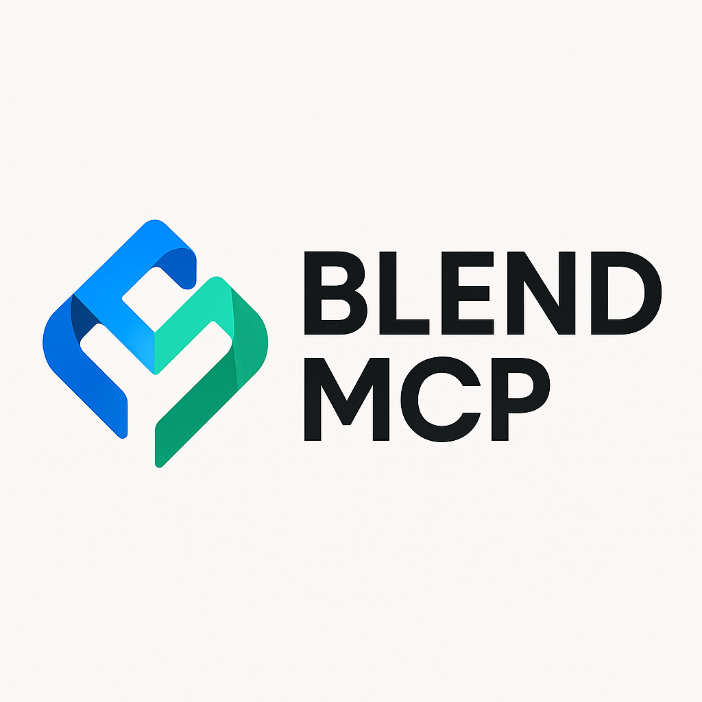

<h1 align="center">Blend MCP</h1>
<p align="center">
  
</p>
<h2 align="center">blend at your fingertips, just command</h2>

**Blend MCP** is the universal AI gateway for the Blend Protocol on Stellar. It exposes all Blend DeFi actions—lending, borrowing, pool creation, risk analysis, and more—as simple, composable tools accessible by any AI assistant, bot, or app.

---

## 🚀 Features

- **Natural Language DeFi:** Lend, borrow, repay, withdraw, and more—by command.
- **Pool Management:** Create and manage Blend pools programmatically.
- **Risk Analysis:** Fetch and analyze pool/user data for safety and investment decisions.
- **Composable Workflows:** Chain actions together (e.g., "analyze pool, then lend if safe").
- **AI Assistant Integration:** Works with Claude, ChatGPT, or your own custom AI/bot.
- **Extensible:** Add new tools for NFTs, bridges, or any Soroban contract.

---

## 🛠️ MCP Functions & Tools

Blend MCP exposes the following tools (functions) to any AI assistant or app:

| Tool Name           | Description |
|---------------------|-------------|
| `loadPoolData`      | Loads comprehensive data for a given Blend pool (optionally includes user position). |
| `getTokenBalance`   | Gets the balance of a specific token for a user address. |
| `getFeeStats`       | Gets current Soroban network fee statistics. |
| `getPoolEvents`     | Gets historical events for a specific pool. |
| `loadBackstopData`  | Loads data for the main Blend backstop contract. |
| `loadTokenMetadata` | Loads metadata for a given token/asset. |
| `simulateOperation` | Simulates a transaction operation without submitting it. |
| `lend`              | Lend (supply collateral) to a pool. |
| `withdraw`          | Withdraw assets from a pool. |
| `borrow`            | Borrow assets from a pool. |
| `repay`             | Repay borrowed assets to a pool. |
| `claimRewards`      | Claim available rewards from a pool. |
| `createPool`        | Deploy a new, permissionless lending pool. |
| `addReserve`        | Add a new asset reserve to a pool. |
| `buyNft`            | Buy an NFT from a Soroban NFT contract using provided funds. |

Each tool is accessible via natural language or programmatic calls, and can be combined for advanced workflows.

---

## 🔗 Composed Workflows & Advanced Features

Blend MCP's true power is in **composability**—AI assistants or apps can chain these tools to create advanced DeFi workflows:

- **Risk Analysis:**
  1. `loadPoolData` → `loadTokenMetadata` → (optional) `getPoolEvents` → AI summarizes risk.
  2. "Analyze Pool X for risk."
- **Buy Now, Pay Later (BNPL) for NFTs:**
  1. `borrow` → `buyNft` → (optional) `repay` later.
  2. "Buy this NFT and let me pay later using Blend."
- **Automated Lending:**
  1. `loadPoolData` → AI checks safety → `lend` if safe.
  2. "If Pool Y is safe, lend 40% of my XLM."
- **Pool Creation:**
  1. `createPool` → `addReserve` → (optional) set parameters.
  2. "Create a new pool, add a USDC reserve."
- **Custom DeFi Strategies:**
  1. Any combination of the above tools, orchestrated by an AI or app.
  2. "Borrow from Pool Z, buy an NFT, and set up a repayment plan."

---

## 🏗️ Architecture


---

## ⚡ Quick Start

### A. Direct Usage (No Clone/Build Needed!)

1. **No install required!** Use the published npm package with `npx`:

   ```jsonc
   {
     "mcpServers": {
       "Blend Protocol MCP": {
         "command": "npx",
         "args": [
           "blend-mcp-stellar"
         ],
         "env": {
           "AGENT_SECRET": "<YOUR_STELLAR_SECRET_KEY>",
           "RPC_URL": "https://soroban-testnet.stellar.org",
           "BACKSTOP_ID_V2": "<OPTIONAL_BACKSTOP_ID_V2>",
           "POOL_FACTORY_ID": "<OPTIONAL_POOL_FACTORY_ID>"
         }
       }
     }
   }
   ```
   - Save as `.cursor/mcp.json` (for most MCP clients) or `claude_desktop_config.json` (for Claude Desktop).
   - **Just add your agent secret!**

2. **Run your AI assistant** (Claude, ChatGPT, or any MCP-compatible client) and connect using the config above.

### B. Local Setup (for development)

1. **Clone the repo:**
   ```bash
   git clone [your-repo-url]
   cd BlendMcp
   yarn install # or npm install
   ```
2. **Set your environment variables:**
   - `AGENT_SECRET` (your Stellar secret key for signing transactions)
   - (Optional) `POOL_FACTORY_ID`, `BACKSTOP_ID`, etc. for advanced features
3. **Build and run:**
   ```bash
   npm run build
   # then run your MCP server as needed
   ```

---

## 🤖 How to Connect Your AI Assistant

- **Claude Desktop:**
  - Add the config above to `claude_desktop_config.json`.
  - [Anthropic MCP Docs](https://docs.anthropic.com/en/docs/mcp)
  - [MCP Connector Guide](https://docs.anthropic.com/en/docs/agents-and-tools/mcp-connector)
  - [Claude Desktop Integration Example](https://github.com/davidteren/claude-server/blob/main/docs/CLAUDE_DESKTOP_INTEGRATION.md)
- **Other Assistants:**
  - Use the same config format for any MCP-compatible client.

---

## 🛠️ Contributing

- PRs and issues welcome! This project will be in active development even after the stellar blend hackathon.
- Want to add a new tool or integration? Open an issue or PR.

---

## 📬 Contact

- Tanishq — tanishq162005@gmail.com

---

## 📝 Notes

- **Blend MCP is under active development.** More features and integrations are coming soon!
- Built for the Stellar Blend hackathon, but designed for long-term extensibility and composability.
